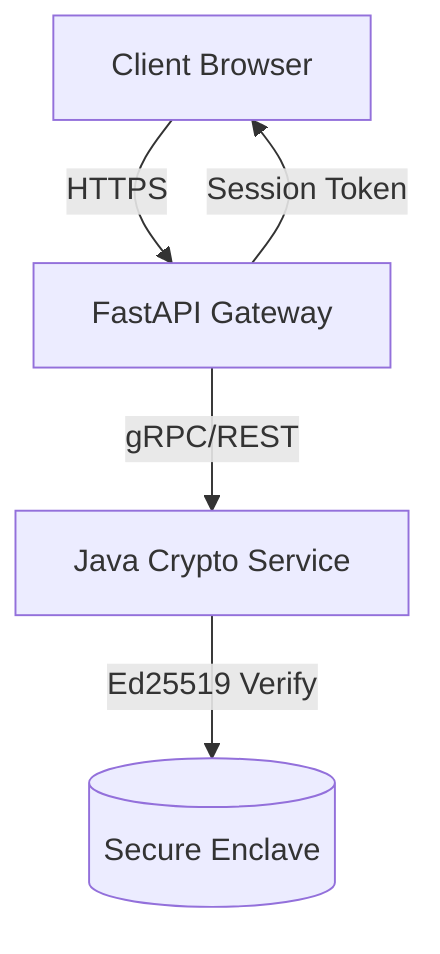

# AETHER // VAULT

Institutional-grade digital asset custody interface. 

## Architecture

The system utilizes a microservices architecture optimized for high-throughput cryptographic operations and zero-trust frontend interactions.



## Security Posture

- **Transport:** TLS 1.3 enforced. HSTS preloaded.
- **Authentication:** Ed25519 elliptic curve signatures. No passwords.
- **Rate Limiting:** Sliding window algorithm at the API gateway (5 req/min/IP).
- **Frontend:** Strict Content Security Policy (CSP). Subresource Integrity (SRI) on all external assets.

## Deployment

### Prerequisites
- Python 3.11+
- Node.js 20+
- Java 21+ (LTS)
- Docker & Docker Compose

### Local Development

```bash
git clone https://github.com/aether-holdings/vault.git
cd vault
docker-compose up --build
```

The frontend will be available at `http://localhost:3000` and the API gateway at `http://localhost:8000`.

## References

Garrett, J. J. (2010). *The elements of user experience: User-centered design for the web and beyond*. New Riders.

National Institute of Standards and Technology. (2015). *Digital Signature Standard (DSS)* (FIPS PUB 186-4). U.S. Department of Commerce. https://doi.org/10.6028/NIST.FIPS.186-4

Nielsen, J. (2020). *10 usability heuristics for user interface design*. Nielsen Norman Group. https://www.nngroup.com/articles/ten-usability-heuristics/

Stallings, W. (2020). *Cryptography and network security: Principles and practice* (8th ed.). Pearson.
```
